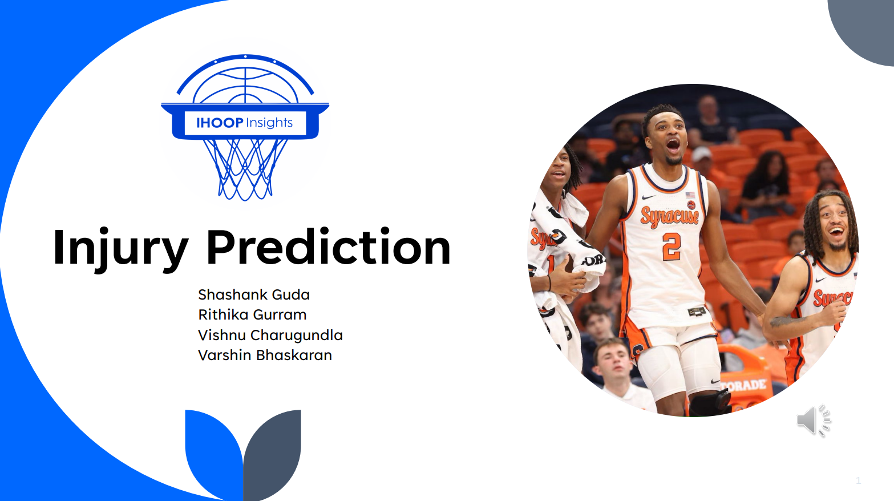
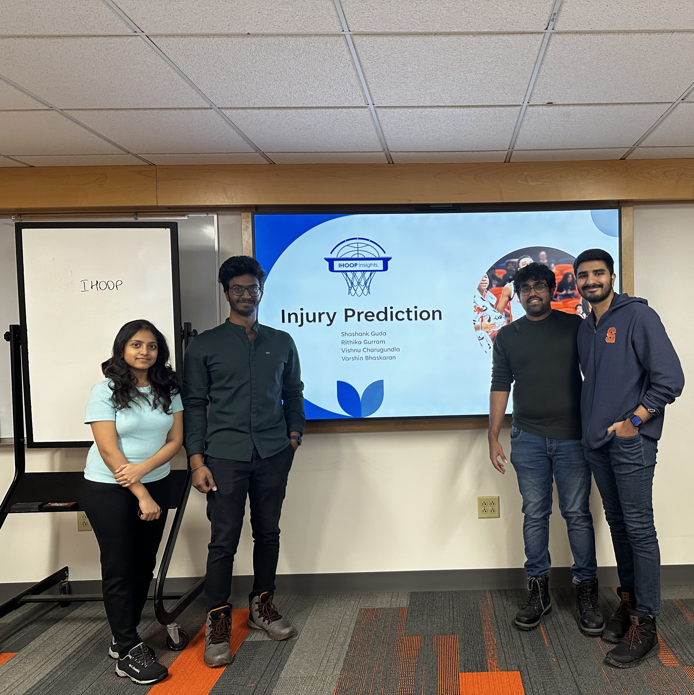

# iHoopInsight - Player Injury Prediction

## Overview
**iHoopInsight** is the winning project of the 2024 Orange Hoops Data Science Challenge, focused on predicting player injuries in basketball. Our team developed an advanced machine learning model that calculates an injury risk score for each player. This model leverages various player performance metrics and muscle imbalances to help identify and mitigate injury risks, enabling coaches and teams to improve player safety and performance.

## Team Members

#### **Right to Left**
- **Shashank Guda (Team Leader)**
- **Varshin Bhaskaran**
- **Vishnu Charugundla**
- **Rithika Gurram**

## Project Objective
The primary goal was to predict the risk of injuries in basketball players based on their performance metrics, muscle imbalances, and other factors like position and heart rate. The project involved the analysis of over 2,600 records of 14 players over the course of a year, providing actionable insights into injury prevention.

## Key Insights
- **Injury Risk Factors**: Key contributors to injury risk include muscle imbalances such as the Hamstring-to-Quad ratio and calf imbalances. Guards are generally at a higher risk for injury based on these metrics.
- **Injury Types**: Muscle strains and tendonitis were found to be the most common injuries.
- **Risk Prediction Model**: A Random Forest classifier was used to predict injury risk with high precision and recall for injured players.

## Links
### Project Details:
- 🎥 [Project Explanation on YouTube](https://www.youtube.com/watch?v=BuIZEGiOogM)
- 📊 [Jupyter Notebook with Detailed Analysis](https://github.com/gudashashank/ihoop_insights_injury_prediction/blob/main/Injury_Prediction_iHoopInsights.ipynb)
- 📰 [iSchool Announcement](https://ischool.syracuse.edu/ischool-announces-winners-of-the-orange-hoops-data-science-challenge/)
- 💼 [LinkedIn Post](https://www.linkedin.com/posts/ischoolsu_this-years-orange-hoops-data-science-challenge-activity-7285309798584135680-OezB/)

## Approach
We utilized data analytics and machine learning techniques to explore the factors contributing to player injuries:
1. **Exploratory Data Analysis (EDA)**: Analyzed the data for patterns, including muscle imbalances and performance metrics like distance, speed, and heart rate.
2. **Correlation Analysis**: Identified significant relationships between muscle imbalances and injury likelihood.
3. **Model Development**: Used a Random Forest classifier to create an injury prediction model based on key features such as muscle imbalances, player position, and performance metrics.

## Results
- **Injury Prediction Model**: The model achieved a **precision of 0.32** and a **recall of 0.98** for injured players, with an **ROC AUC Score of 0.9**.
- **Risk Scores**: Players were classified into various risk levels, with **Guards** being at the highest risk.
- **Recommendations**: Focused on improving muscle balance, particularly in the Hamstring-to-Quad ratio, and targeted injury prevention strategies for Guards and Forwards.

## Conclusion
The project successfully developed an effective injury risk model that can be used to predict injury risk based on key performance metrics. It emphasizes the importance of muscle imbalances as a critical factor in injury prevention. Regular monitoring and targeted interventions can significantly improve player safety.

## Future Work
Further calibration of the model and incorporating more data sources (e.g., real-time injury monitoring) could improve the precision of injury predictions.

